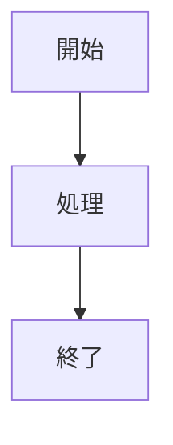

# Web Games Documentation

Web Gamesプロジェクトの設計書・仕様書・ドキュメントを管理するリポジトリです。

## 📚 概要

このリポジトリは[MkDocs](https://www.mkdocs.org/)と[Material for MkDocs](https://squidfunk.github.io/mkdocs-material/)を使用して、プロジェクトドキュメントを体系的に管理しています。

## 🛠️ 環境構築

### 必要なもの

- Python 3.x
- pip

### セットアップ

```bash
# MkDocsとMaterial themeのインストール
pip install mkdocs mkdocs-material pymdown-extensions

# リポジトリのクローン
git clone https://github.com/tktaka20/web-games-docs.git
cd web-games-docs
```

## 🚀 使い方

### ローカルプレビュー

```bash
# 開発サーバーの起動（ホットリロード有効）
mkdocs serve

# ブラウザで http://127.0.0.1:8000 を開く
```

### ビルド

```bash
# 静的HTMLを生成（site/ フォルダに出力）
mkdocs build
```

### ZIP配布用ビルド

```bash
# ビルド
mkdocs build

# ZIP作成
cd site
zip -r ../docs-distribution.zip .
cd ..
```

生成されたZIPファイルを展開し、`index.html`をブラウザで開くことで、**オフライン環境でもドキュメントを閲覧**できます。

## 📁 ディレクトリ構造

```
web-games-docs/
├── docs/               # ドキュメントソース（Markdown）
│   ├── index.md       # ホームページ
│   ├── IF定義書/      # インターフェース定義書
│   ├── 処理機能記述書/ # 処理機能記述書
│   ├── DB定義書/      # データベース定義書
│   └── ...
├── mkdocs.yml         # MkDocs設定ファイル
├── site/              # ビルド出力（自動生成、Git管理外）
└── README.md
```

## ✏️ ドキュメントの編集方法

### 新規ページの追加

1. `docs/` フォルダ内に Markdown ファイルを作成
2. `mkdocs.yml` の `nav` セクションにページを追加

```yaml
nav:
  - ホーム: index.md
  - 新しいセクション:
    - ページ1: section/page1.md
    - ページ2: section/page2.md
```

### Mermaid図の記述

MkDocsはMermaid記法をサポートしています：

````markdown

````

## 🔗 関連リポジトリ

- [web-games](https://github.com/tktaka20/web-games) - 本番コード（ゲーム実装）

## 📋 ドキュメントの種類

- **IF定義書**: 外部システムとのインターフェース仕様
- **処理機能記述書**: システムの内部処理ロジック
- **DB定義書**: データベーススキーマ定義
- **開発ガイド**: GitHub Flow、バージョン管理、Issue管理

## 🎯 特徴

- **オフライン閲覧可能**: ZIP配布で社内チームに共有可能
- **Mermaid対応**: フローチャート、シーケンス図、ER図等
- **検索機能**: 全文検索対応
- **日本語対応**: UIとコンテンツの完全日本語化
- **レスポンシブ**: PC・タブレット・スマホ対応

## 📄 ライセンス

このドキュメントリポジトリはプロジェクト内部用です。
