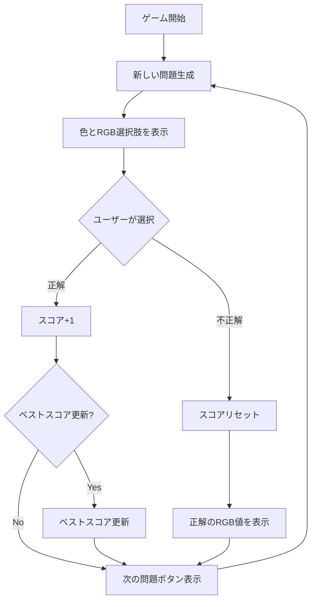

# 色当てゲーム（Color Guess Game）

## ゲーム概要

RGB値から正しい色を当てるゲームです。表示された色と3つのRGB値の選択肢から、正しいRGB値を選びます。色彩感覚と記憶力を鍛えることができます。

## 主要機能

### 基本ゲームプレイ
- ランダムな色（RGB値）を画面に表示
- 3つのRGB値の選択肢から正解を選択
- 正解で連続スコア増加、不正解でスコアリセット
- ベストスコア記録機能

### スコアシステム
- **現在のスコア**: 連続正解数（不正解でリセット）
- **ベストスコア**: localStorage保存、最高記録を保持
- リアルタイムでスコア更新表示

### 問題生成システム
- RGB各色を0〜255のランダム値で生成
- ダミー選択肢は正解から±50の範囲で生成
- 選択肢はランダムにシャッフル
- 適度な難易度を維持

### フィードバック機能
- 正解時: 緑色で「正解！」表示
- 不正解時: 赤色で「不正解」と正解のRGB値を表示
- ボタンの色でも視覚的フィードバック

## UI/UX仕様

### レイアウト構成
1. **カラーディスプレイエリア**
   - 正解の色を大きく表示
   - 中央配置、正方形デザイン
   - グラデーション効果なしのフラットカラー

2. **スコア表示エリア**
   - 現在のスコア（左側）
   - ベストスコア（右側）
   - リアルタイム更新

3. **選択肢ボタン**
   - 3つのRGB値を表示
   - クリック可能なボタン形式
   - 正解/不正解で色変化（緑/赤）

4. **結果メッセージ**
   - 正解/不正解の表示
   - 不正解時は正解値も表示
   - 次の問題ボタン

### カラースキーム
- **正解**: 緑色 (#27ae60)
- **不正解**: 赤色 (#e74c3c)
- **ボタン**: 紫系グラデーション (#667eea 〜 #764ba2)
- **背景**: 白ベース、カード型デザイン

### レスポンシブデザイン
- PC/スマホ両対応
- フレキシブルレイアウト
- タッチ操作最適化

## 技術仕様

### クラス構造

#### ColorGuessGame クラス

主要プロパティ:
```javascript
{
  currentScore: Number,           // 現在のスコア（連続正解数）
  bestScore: Number,              // ベストスコア
  correctRGB: Object,             // 正解のRGB値 {r, g, b}
  choices: Array<Object>,         // 選択肢の配列
  correctIndex: Number,           // 正解のインデックス
  colorDisplay: HTMLElement,      // カラーディスプレイ要素
  resultMessage: HTMLElement,     // 結果メッセージ要素
  currentScoreEl: HTMLElement,    // 現在スコア表示要素
  bestScoreEl: HTMLElement,       // ベストスコア表示要素
  choiceBtns: NodeList,           // 選択肢ボタン群
  nextBtn: HTMLElement            // 次へボタン
}
```

主要メソッド:
```javascript
initElements()                  // DOM要素の初期化
initEventListeners()            // イベントリスナー設定
generateRandomColor()           // ランダムRGB生成
rgbToString(rgb)                // RGB→文字列変換
rgbToCss(rgb)                   // RGB→CSS形式変換
generateDummyColor(correct)     // ダミー選択肢生成
newQuestion()                   // 新しい問題を生成
checkAnswer(selectedIndex)      // 回答チェック
updateScoreDisplay()            // スコア表示更新
saveBestScore()                 // ベストスコア保存
loadBestScore()                 // ベストスコア読み込み
```

### データ管理（localStorage）

| キー | データ型 | 説明 |
|------|---------|------|
| `colorGuessBestScore` | String (Number) | ベストスコア |

### RGB値生成アルゴリズム

#### 正解の色
```javascript
generateRandomColor() {
  const r = Math.floor(Math.random() * 256); // 0-255
  const g = Math.floor(Math.random() * 256);
  const b = Math.floor(Math.random() * 256);
  return { r, g, b };
}
```

#### ダミーの選択肢
```javascript
generateDummyColor(correct) {
  const variation = 50; // ±50の範囲
  return {
    r: Math.max(0, Math.min(255, correct.r + (rand * 2 - 1) * variation)),
    g: Math.max(0, Math.min(255, correct.g + (rand * 2 - 1) * variation)),
    b: Math.max(0, Math.min(255, correct.b + (rand * 2 - 1) * variation))
  };
}
```

特徴:
- 正解から±50の範囲でランダム生成
- 0-255の範囲内に制限
- 適度な難易度を維持

### 選択肢のシャッフル

```javascript
this.choices.sort(() => Math.random() - 0.5);
```

Fisher-Yates的なシャッフルアルゴリズムで選択肢をランダム化。

## ファイル構成

```
color-guess/
├── index.html          # メインHTML
└── src/
    ├── script.js       # ゲームロジック（ColorGuessGameクラス）
    ├── style.css       # スタイル定義
    └── i18n.js         # 多言語対応（日本語/英語）
```

## 多言語対応（i18n.js）

### 対応言語
- 日本語（デフォルト）
- 英語

### 翻訳対象
- タイトル
- スコア表示ラベル
- 正解/不正解メッセージ
- ボタンテキスト

### 実装方式
グローバル `window.i18n` オブジェクトを使用：

```javascript
window.i18n.t('correctMessage')   // 翻訳取得
window.i18n.setLanguage('en')     // 言語切り替え
```

## ゲームフロー



## テスト状況

### 現状
- 手動テスト実施済み
- 自動テスト未実装

### 今後のテスト計画

#### ユニットテスト（Vitest）
1. RGB生成ロジック
   - `generateRandomColor()`: 0-255範囲のテスト
   - `generateDummyColor()`: ±50範囲のテスト
   - 境界値テスト（0, 255付近）

2. RGB変換関数
   - `rgbToString()`: 正しいフォーマットのテスト
   - `rgbToCss()`: CSS形式のテスト

3. スコア管理
   - 連続正解時のスコア増加
   - 不正解時のリセット
   - ベストスコア更新ロジック

4. localStorage
   - 保存・読み込みのテスト
   - 初回起動時の動作

#### E2Eテスト（Playwright）
- ゲームフロー全体
- ボタンクリック動作
- スコア表示の更新
- 言語切り替え

## 既知の問題・制限事項

なし（安定動作中）

## 今後の改善案

- [ ] 難易度選択機能（Easy: ±100、Hard: ±20など）
- [ ] タイマー機能（制限時間内に回答）
- [ ] ヒント機能（一部のRGB値を表示）
- [ ] 統計機能（正解率、平均スコアなど）
- [ ] リーダーボード機能
- [ ] カラーパレット表示（色空間の可視化）
- [ ] サウンドエフェクト
- [ ] 自動テスト実装

## 学習効果

このゲームで向上できるスキル：
- **RGB値の理解**: 色を数値で認識する能力
- **色彩感覚**: 微妙な色の違いを識別する能力
- **記憶力**: 数値と色の関連付け
- **集中力**: 連続正解を目指すことで集中力向上

## 参考リンク

- [ライブデモ](https://takakichi.com/web-games/color-guess/)
- [ソースコード](https://github.com/tktaka20/web-games/tree/main/color-guess)
- [RGB色空間 - Wikipedia](https://ja.wikipedia.org/wiki/RGB)
