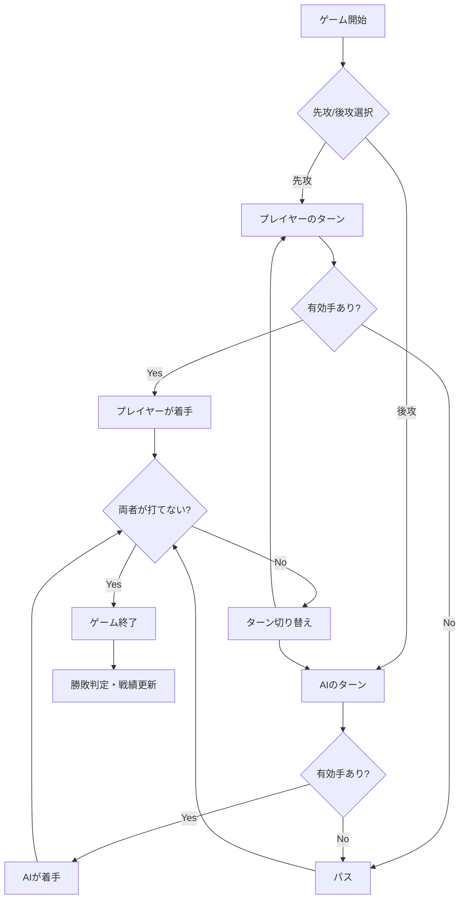

# リバーシ（オセロ）

## ゲーム概要

定番ボードゲーム「リバーシ（オセロ）」の実装です。AIと対戦し、8×8のボード上で石を挟んで裏返し、最終的により多くの石を持つプレイヤーが勝利します。

## 主要機能

### 基本ゲームプレイ
- AIとの1人プレイ
- 8×8のボード
- 石を挟んで裏返すルール
- 打てる場所がない場合は自動パス
- 両者が打てない場合はゲーム終了

### AI機能
3段階のAIレベルを実装：

| レベル | 思考方式 | 説明 |
|--------|---------|------|
| 初級 | ランダム | 有効な手からランダムに選択 |
| 中級 | 位置評価 | 位置による重み付け評価 |
| 上級 | 深い評価 | 位置評価 + 獲得石数重視 |

### 先攻/後攻選択
- **先攻（黒）**: プレイヤーが先手
- **後攻（白）**: AIが先手
- ゲーム途中で役割入れ替え可能
- 新規ゲーム/ゲーム継続の切り替え

### 戦績管理機能
- AIレベルごとに戦績を記録（勝/敗/分）
- 勝率の自動計算・表示
- localStorage保存
- レベル別リセット機能

### ゲーム補助機能
- **有効マス表示**: 打てる場所を点で表示（ON/OFF切り替え可）
- **ヒント機能**: 最善手を黄色でハイライト表示
- **石数カウント**: リアルタイム表示

### アニメーション
- 石が裏返るアニメーション（flip効果）
- ターン切り替え時の視覚フィードバック
- ゲームオーバー時の演出

## UI/UX仕様

### レイアウト構成

1. **ヘッダー**
   - ゲームタイトル
   - 戦績表示（AIレベル別）
   - 戦績リセットボタン

2. **プレイヤー情報パネル**
   - 黒（プレイヤー）の石アイコンと石数
   - 白（AI）の石アイコンと石数
   - 現在のターン表示（背景色でハイライト）

3. **ゲームボード**
   - 8×8グリッド
   - 緑色のフェルト風背景
   - 石の立体的なデザイン
   - 有効マス表示（白い点）

4. **メッセージエリア**
   - ターン情報
   - パス通知
   - ゲーム結果

5. **コントロールボタン**
   - 新しいゲーム
   - ヒント表示
   - 有効マス表示ON/OFF
   - 先攻/後攻選択
   - AIレベル選択
   - ゲーム一覧に戻る

### カラースキーム
- **ボード背景**: 緑 (#2d5016)
- **黒石**: グラデーション (#333 → #000)
- **白石**: グラデーション (#fff → #ddd)
- **有効マス**: 半透明白 (rgba(255, 255, 255, 0.4))
- **ヒント**: 黄色 (#ffd93d)
- **アクティブプレイヤー**: 紫 (#667eea)

### レスポンシブデザイン
- PC/スマホ両対応
- セルサイズの自動調整
- タッチ操作最適化

## 技術仕様

### クラス構造

#### ReversiGame クラス

主要プロパティ:
```javascript
{
  BOARD_SIZE: 8,                        // ボードサイズ
  BLACK: 1,                             // 黒石の定数
  WHITE: 2,                             // 白石の定数
  EMPTY: 0,                             // 空マスの定数
  board: Array<Array<Number>>,          // 盤面状態
  currentPlayer: Number,                // 現在のプレイヤー
  gameOver: Boolean,                    // ゲーム終了フラグ
  isAIThinking: Boolean,                // AI思考中フラグ
  playerColor: Number,                  // プレイヤーの色
  aiColor: Number,                      // AIの色
  showValidMoves: Boolean,              // 有効マス表示フラグ
  aiLevel: String,                      // AIレベル（'easy'/'medium'/'hard'）
  stats: Object                         // 戦績データ
}
```

主要メソッド:
```javascript
init()                               // 初期化
createBoard()                        // ボード作成
initializeBoard()                    // 盤面初期化
renderBoard()                        // ボード描画
handleCellClick(row, col)            // セルクリック処理
isValidMove(row, col, player)        // 有効手判定
checkDirection(row, col, dx, dy, player) // 方向チェック
makeMove(row, col, player)           // 石を置く
flipStones(row, col, dx, dy, player) // 石を裏返す
getValidMoves(player)                // 有効手一覧取得
switchPlayer()                       // プレイヤー切り替え
updatePlayerDisplay()                // プレイヤー表示更新
updateScore()                        // スコア更新
endGame()                            // ゲーム終了処理
newGame(skipAIMove)                  // 新しいゲーム
showHint()                           // ヒント表示
aiMove()                             // AI思考・着手
getBestMove(player)                  // 最善手計算
evaluateMove(row, col, player)       // 手の評価
startGameAs(color)                   // 先攻/後攻選択
toggleValidMoves()                   // 有効マス表示切り替え
setAILevel(level)                    // AIレベル設定
loadStats()                          // 戦績読み込み
saveStats()                          // 戦績保存
updateStatsDisplay()                 // 戦績表示更新
resetStats()                         // 戦績リセット
```

### データ管理（localStorage）

| キー | データ型 | 説明 |
|------|---------|------|
| `reversi-stats` | JSON Object | AIレベル別の戦績 |

#### reversi-statsの構造
```javascript
{
  easy: {
    wins: Number,    // 勝利数
    losses: Number,  // 敗北数
    draws: Number    // 引き分け数
  },
  medium: {
    wins: Number,
    losses: Number,
    draws: Number
  },
  hard: {
    wins: Number,
    losses: Number,
    draws: Number
  }
}
```

### 有効手判定アルゴリズム

```javascript
isValidMove(row, col, player) {
  if (this.board[row][col] !== this.EMPTY) return false;

  const directions = [
    [-1, -1], [-1, 0], [-1, 1],
    [0, -1],           [0, 1],
    [1, -1],  [1, 0],  [1, 1]
  ];

  for (const [dx, dy] of directions) {
    if (this.checkDirection(row, col, dx, dy, player)) {
      return true;
    }
  }
  return false;
}

checkDirection(row, col, dx, dy, player) {
  let x = row + dx;
  let y = col + dy;
  let foundOpponent = false;

  while (x >= 0 && x < 8 && y >= 0 && y < 8) {
    if (this.board[x][y] === this.EMPTY) return false;
    if (this.board[x][y] === player) return foundOpponent;
    foundOpponent = true;
    x += dx;
    y += dy;
  }
  return false;
}
```

特徴:
- 8方向をチェック
- 相手の石を挟んでいるか確認
- 効率的な判定ロジック

### AI評価関数

#### 位置による重み付け
```javascript
const positionWeights = [
  [100, -20, 10,  5,  5, 10, -20, 100],
  [-20, -50, -2, -2, -2, -2, -50, -20],
  [ 10,  -2, 10,  1,  1, 10,  -2,  10],
  [  5,  -2,  1,  1,  1,  1,  -2,   5],
  [  5,  -2,  1,  1,  1,  1,  -2,   5],
  [ 10,  -2, 10,  1,  1, 10,  -2,  10],
  [-20, -50, -2, -2, -2, -2, -50, -20],
  [100, -20, 10,  5,  5, 10, -20, 100]
];
```

戦略:
- **角（100）**: 最重要、取られない
- **角の隣（-20, -50）**: 避ける、角を取られるリスク
- **辺（10）**: 有利な位置
- **内側（1）**: 中立

#### レベル別評価
- **初級**: ランダム選択（評価なし）
- **中級**: 位置評価のみ、獲得石数×2
- **上級**: 位置評価 + 獲得石数×5（石数重視）

### パス処理

```javascript
switchPlayer() {
  const validMoves = this.getValidMoves(nextPlayer);

  if (validMoves.length === 0) {
    // 次のプレイヤーが打てない場合
    const currentValidMoves = this.getValidMoves(this.currentPlayer);
    if (currentValidMoves.length === 0) {
      // 両方打てない場合はゲーム終了
      this.endGame();
      return;
    }
    // パスメッセージ表示
    this.showMessage(`${nextPlayer}はパスです`);
    return;
  }

  this.currentPlayer = nextPlayer;
  this.updatePlayerDisplay();
}
```

## ファイル構成

```
reversi/
└── src/
    └── index.html          # メインHTML（全機能統合版）
                            # - HTML構造
                            # - CSS（<style>タグ）
                            # - JavaScript（<script>タグ、ReversiGameクラス）
```

特徴:
- **完全単一ファイル実装**
- 外部依存なし
- 約1000行の統合コード
- デプロイ・配布が容易

## ゲームフロー



## テスト状況

### 現状
- 手動テスト実施済み
- 自動テスト未実装

### 今後のテスト計画

#### ユニットテスト（Vitest）
1. **ボード初期化**
   - 初期配置の正確性
   - 石数の確認

2. **有効手判定**
   - 各方向の挟み判定
   - 角・辺・内側の判定
   - 無効な手の検出

3. **石の裏返し**
   - 各方向の裏返し処理
   - 複数方向の同時裏返し
   - 裏返し数のカウント

4. **パス処理**
   - 有効手がない場合のパス
   - 両者パス時のゲーム終了

5. **ゲーム終了判定**
   - 勝敗判定
   - 引き分け判定
   - 石数カウント

6. **AI思考**
   - 各レベルの手選択
   - 評価関数の正確性

7. **戦績管理**
   - localStorage保存/読み込み
   - 勝率計算
   - レベル別集計

#### E2Eテスト（Playwright）
- ゲームフロー全体
- 先攻/後攻選択
- AI対戦
- 有効マス表示/ヒント機能
- AIレベル切り替え

## 既知の問題・制限事項

なし（安定動作中）

## 今後の改善案

- [ ] AI強化（ミニマックス法、α-β枝刈り）
- [ ] 2人対戦モード
- [ ] オンライン対戦機能
- [ ] 棋譜記録・再生機能
- [ ] Undo/Redo機能
- [ ] 定石データベース
- [ ] 詳細統計（平均石数、最多勝利など）
- [ ] カスタムボードサイズ（6×6、10×10など）
- [ ] ハンディキャップ機能
- [ ] 自動テスト実装

## オセロ戦略ガイド

### 基本戦略
1. **角を取る**: 最重要、取られない位置
2. **辺を制する**: 安定した位置
3. **序盤は少なく**: 終盤の選択肢を増やす
4. **相手の手を減らす**: パスに追い込む

### 位置の価値
- **A（角）**: 最高価値、絶対取る
- **X（角の隣）**: 危険、角を渡すリスク
- **C（角の斜め）**: 注意が必要
- **B（辺）**: 良い位置
- **内側**: 序盤は慎重に

```
  A B C D E F G H
1 A X C C C C X A
2 X X C C C C X X
3 C C C C C C C C
4 C C C C C C C C
5 C C C C C C C C
6 C C C C C C C C
7 X X C C C C X X
8 A X C C C C X A
```

## パフォーマンス最適化

### 実装済み
- 効率的な盤面評価
- イベントリスナーの最適化
- アニメーションのGPU加速

### 今後の最適化案
- Web WorkerでのAI思考
- ミニマックス法の深さ制限
- 評価関数のキャッシュ

## 技術的ハイライト

### 1. 単一ファイル実装
- HTML/CSS/JavaScript統合
- 外部依存なし
- デプロイが容易

### 2. 柔軟なAIシステム
- 3段階のレベル
- 評価関数のカスタマイズ
- 拡張性の高い設計

### 3. 戦績管理
- AIレベル別記録
- localStorage活用
- 勝率自動計算

## 参考リンク

- [ライブデモ](https://takakichi.com/web-games/reversi/src/)
- [ソースコード](https://github.com/tktaka20/web-games/tree/main/reversi)
- [オセロ - Wikipedia](https://ja.wikipedia.org/wiki/%E3%82%AA%E3%82%BB%E3%83%AD_(%E3%83%9C%E3%83%BC%E3%83%89%E3%82%B2%E3%83%BC%E3%83%A0))
- [リバーシ戦略 - Wikipedia](https://ja.wikipedia.org/wiki/%E3%83%AA%E3%83%90%E3%83%BC%E3%82%B7#%E6%88%A6%E7%95%A5)
