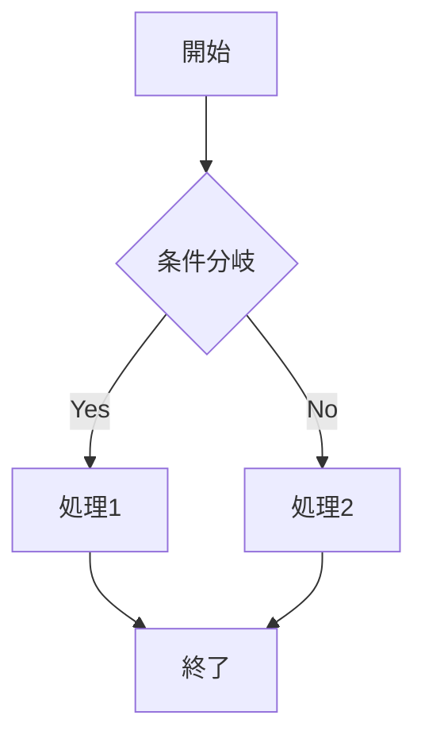
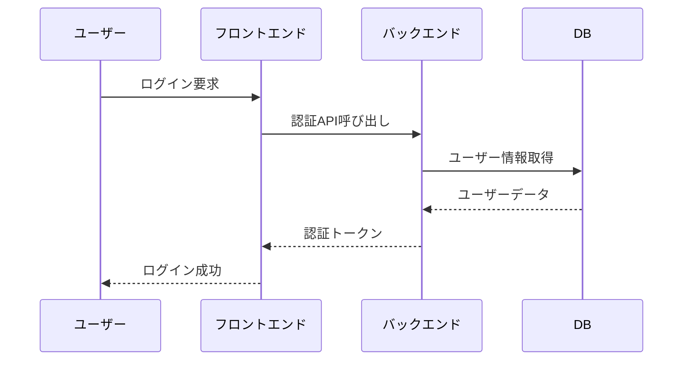
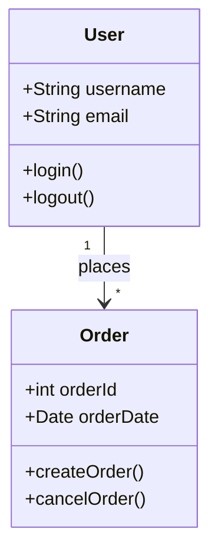
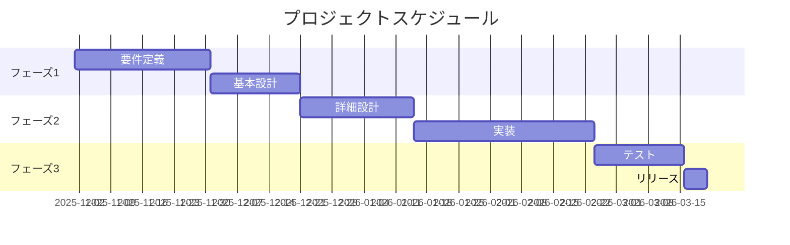
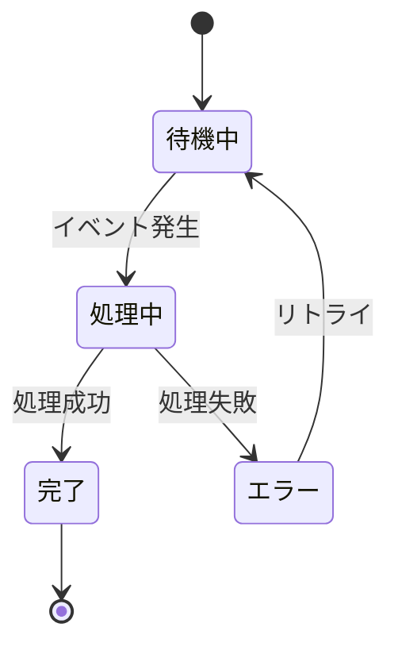
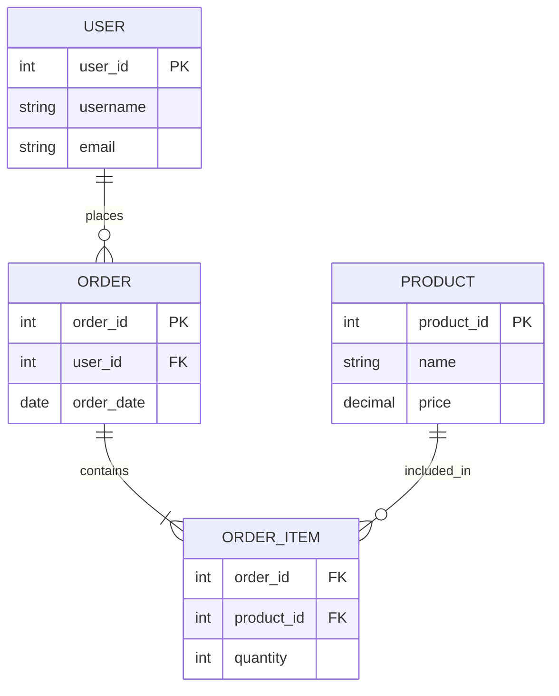

# Mermaid図のテスト

MkDocsでMermaid記法が正しく表示されるかテストします。

## フローチャート

```mermaid
graph TD
    A[開始] --> B{条件分岐}
    B -->|Yes| C[処理1]
    B -->|No| D[処理2]
    C --> E[終了]
    D --> E
```

## シーケンス図

```mermaid
sequenceDiagram
    participant ユーザー
    participant フロントエンド
    participant バックエンド
    participant DB

    ユーザー->>フロントエンド: ログイン要求
    フロントエンド->>バックエンド: 認証API呼び出し
    バックエンド->>DB: ユーザー情報取得
    DB-->>バックエンド: ユーザーデータ
    バックエンド-->>フロントエンド: 認証トークン
    フロントエンド-->>ユーザー: ログイン成功
```

## クラス図

```mermaid
classDiagram
    class User {
        +String username
        +String email
        +login()
        +logout()
    }

    class Order {
        +int orderId
        +Date orderDate
        +createOrder()
        +cancelOrder()
    }

    User "1" --> "*" Order : places
```

## ガントチャート

```mermaid
gantt
    title プロジェクトスケジュール
    dateFormat  YYYY-MM-DD
    section フェーズ1
    要件定義           :a1, 2025-11-01, 30d
    基本設計           :a2, after a1, 20d
    section フェーズ2
    詳細設計           :b1, after a2, 25d
    実装              :b2, after b1, 40d
    section フェーズ3
    テスト            :c1, after b2, 20d
    リリース           :c2, after c1, 5d
```

## 状態遷移図

```mermaid
stateDiagram-v2
    [*] --> 待機中
    待機中 --> 処理中: イベント発生
    処理中 --> 完了: 処理成功
    処理中 --> エラー: 処理失敗
    エラー --> 待機中: リトライ
    完了 --> [*]
```

## ER図

```mermaid
erDiagram
    USER ||--o{ ORDER : places
    USER {
        int user_id PK
        string username
        string email
    }
    ORDER ||--|{ ORDER_ITEM : contains
    ORDER {
        int order_id PK
        int user_id FK
        date order_date
    }
    PRODUCT ||--o{ ORDER_ITEM : included_in
    PRODUCT {
        int product_id PK
        string name
        decimal price
    }
    ORDER_ITEM {
        int order_id FK
        int product_id FK
        int quantity
    }
```
