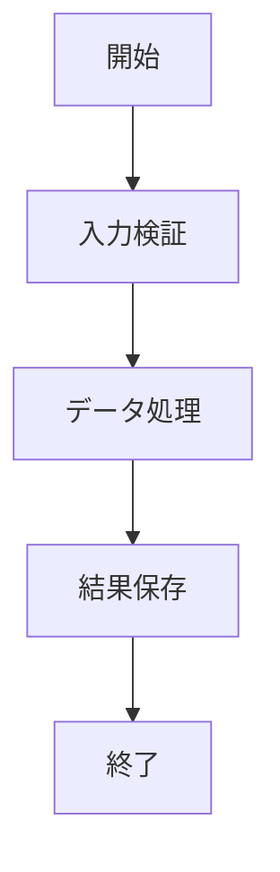

# 処理機能A記述書

## 概要
処理機能Aの詳細な動作を記述します。

## 処理フロー

## 入力パラメータ
| パラメータ名 | 型 | 必須 | 説明 |
|------------|-----|-----|------|
| userId | string | ○ | ユーザーID |
| data | object | ○ | 処理対象データ |
| options | object | × | オプション設定 |

## 出力結果
処理結果をJSON形式で返却します。

## エラーハンドリング
- バリデーションエラー: 入力値不正時
- 処理エラー: 内部処理失敗時
